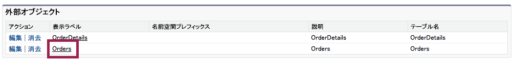

このモジュールでは、サンプルの注文データを含む外部のデータベースへ接続し、Salesforce内の外部オブジェクトで表示を行います。

## 何を学ぶことができるか
- Salesforceでの外部データソースの設定
- 外部データベーススキーマをベースとした外部オブジェクト定義を作成
- 外部データをSalesforceユーザインタフェースで表示する

## ステップ 1: 外部データソースの設定

外部データソースにはSalesforce外のシステムをソースとするデータへの接続設定をすることが可能です。
これはSAPやSharePoint,Jitterbitなどの既存の製品やサービス、または[odata4j](https://code.google.com/p/odata4j/)などのODataライブラリで作られた手製のシステムとの連携を可能にします。

1. Salesforce Developer Editionログインします

1. **設定** をクリックします(右上隅)

1. **開発** > **外部データソース** を選択します(左ナビゲーション)

1. **新規External Data Sources** をクリックします

1.  表示ラベルに **注文データベース** を入力し、名前には **OrderDB** を入力します。

1. 種別に **Lightning Connect: OData 2.0** を選択します。

1. **`https://orderdb.herokuapp.com/orders.svc/`** をURLに入力します。

	

1. 他の設定はデフォルトのままで **保存** をクリックします。

	> これはシンプルな読み込み専用のデータベースで認証がない場合の設定となります。実際の外部システムは認証が必要となるケースがほとんどですが、Lightning コネクトでは全てのデータソースへのアクセスに同じセットを利用するか、ユーザ毎に異なる認証を行うかを選択することができます。[オンラインヘルプ](https://help.salesforce.com/HTViewHelpDoc?id=platform_connect_add_external_data_source.htm)の'Identity Type'により詳しい情報があります。

これで外部データソースの設定が完了し、Salesforce環境に任意のテーブル定義を読み込むことが可能になりました。

## ステップ 2: 外部オブジェクトの作成

1. もしまだ前のステップにあるOrderDB外部データソースの設定が完了していない場合は、 **開発** > **External Data Sources** をクリックして、OrderDB 外部データ・ソースを定義して下さい。

1.  **検証して同期** をクリックします

	> Lightning コネクトはサンプルのデータベースからOData2.0メタデータを使用して、有効なテーブルのリストを取得します。 [こちらをクリック](https://orderdb.herokuapp.com/orders.svc/$metadata) してメタデータXMLを確認できます。

1.  **Order** 及び **OrderDetails** の両方を選択します。

	

1. **同期** をクリックします。

## ステップ 3: 外部オブジェクトの設定を確認

1. もしまだ前のステップにあるOrderDB外部データソースの設定が完了していない場合は、 **開発** > **External Data Sources** をクリックして、OrderDB 外部データ・ソースを定義して下さい。

1. **外部オブジェクト** を選択し **Orders**をクリックします

	

1. Lightning コネクトは外部オブジェクトをOrderデータベースのメタデータから作成します。カスタムオブジェクトをよく知っていれば、外部オブジェクトは非常に近い使い勝手となっており、すぐに利用できます。Lightning コネクト によって外部オブジェクトにはカスタムオブジェクトと同様にカスタム項目が作成されます。カスタムオブジェクトと外部オブジェクトの主な違いは以下の通りです:
	- 外部オブジェクトのAPI名はサフィックスに `__c` の代わりに `__x` を持ちます。
	- 外部オブジェクトは外部データソースへの参照を持っており、実際のテーブルはソース側にあります。
	- 外部オブジェクトは別の標準項目を持っています。**表示 URL** はレコードの外部データベースのOData 2.0 URL を表しており、 **外部 ID** はレコードごとの主キーの値を表します。

	

## ステップ 4: 注文レコードへアクセスを容易にするためにカスタムタブを作成する

1. **設定** をクリックします。(右上隅)

1. **作成** > **タブ**　をクリックします。

1. **カスタムオブジェクトタブ**　の横の **新規** をクリックします。

1. オブジェクトから **Orders** を選択します。

1. **タブスタイル** の横の虫眼鏡アイコンから好きなスタイルを選択します。

1. **次へ** をクリックします。

1. **次へ** をクリックして標準の表示設定を利用します。

1. **タブを含める**の隣のチェックボックスをクリックし、全てのアプリの選択を外します。

1. **External Orders** の隣のチェックボックスを選択します。

1. **保存** をクリックします。

## ステップ 5: 外部の注文データを確認する

1. もしアプリケーションメニュー (右上) が**External Orders** を表示していない場合は、アプリケーションメニューから選択します。

	

1. Orders タブを選択します。

1. **Go!** ボタンをクリックし、Allを選択します。

	

	Lightning コネクトは最初の25個の注文レコードのIdを注文データベースより取得します。

1. １つのオーダーの外部IDの値をクリックします。

	

	Lightning コネクトは選択したレコードの全ての項目の値を取得し表示します。

	> 外部データはSaleforceにコピーされることは無いという点は重要です。Lightning コネクトは常に現在の外部データをリアルタイムに取得しに行きます。

これで外部データをSalesforceで表示できました。ここから既存のデータへ*参照関係*を作成してつなげていきましょう。

<a href="create-developer-edition.html" class="btn btn-default"><i class="glyphicon glyphicon-chevron-left"></i> 戻る</a>
<a href="create-lookup-relationships.html" class="btn btn-default pull-right">次へ <i class="glyphicon glyphicon-chevron-right"></i></a>

