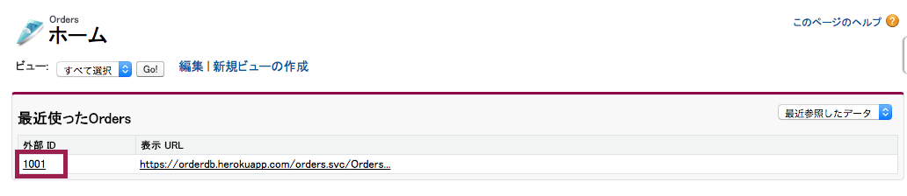
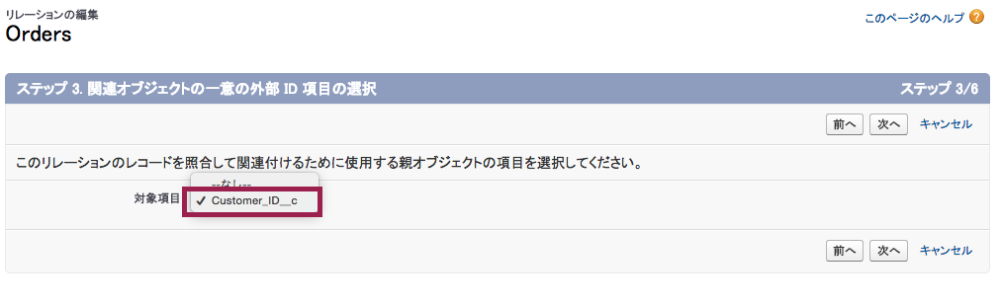
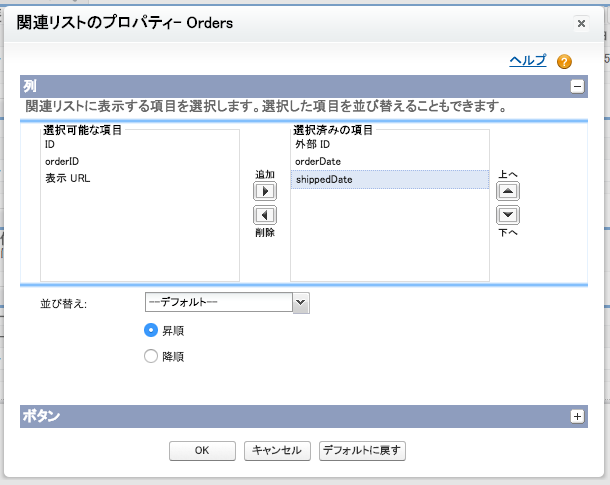

Now you can see external order data in Salesforce; in this module, you will configure lookup relationships to link orders to their line items, and to accounts in Salesforce.

## What you will learn
- Configure an external lookup relationship
- Configure an indirect lookup relationship
- Customize the display of external data

## Step 1: Configure an External Lookup Relationship

In the previous module, you were able to view an order in Salesforce. Recall that when you selected the Orders table for synchronization, you also selected the OrderDetails table, which contains line items for each order. By creating an *external lookup relationship* from OrderDetails to Orders you will be able to see the line items on an order's page in Salesforce.

> You can think of external lookup relationship as modelling a foreign key relationship between any object (standard, custom or external) and an external object. You're telling Salesforce that a field on one object, in this case, OrderId on OrderDetails, corresponds to the external ID field on an external object, in this case, Orders.

1. Login to your Salesforce Developer Edition

1. Click **Setup** (upper right corner)

1. Click **Develop** > **External Objects** (left navigation)

1. Click the **OrderDetails** external object.

	

1. Click the **Edit** link next to Order ID.

	

1. Click the **Change Field Type** button.

	

1. Select **External Lookup Relationship** and click **Next**. An external lookup relationship can link any object to an external object.

1. Select **Orders** as the value of Related To and click **Next**.

	

1. Enter **18** as the value for Length and click **Next**.

1. Enable the **Visible** checkbox to make the relationship visible to all profiles, and click **Next**.

	

	> In a real production deployment, you would carefully analyze which profile should have access to order line items.

1. Click **Save** to accept the defaults - you definitely want an 'OrderDetails' related list on the Orders page layout!

1. If the app menu (top right) is not already showing **External Orders**, then click the app menu and select it.

1. Click the **Orders** tab.

1. Click the External ID of an order in the Recent Orders list.

	

1. You should see a list of line items for the order.

	

1. You can click a line item's External ID to view its details, but let's show line item details right here on the related list. Select the Force.com Quick Access Menu by clicking the gray triangle on the right of the page.

	

1. Click **Edit Layout**.

	

1. Scroll down to the **OrderDetails** related list, and click the wrench icon.

	

1. Remove **Display URL** from the Selected Fields, add **product**, **quantity** and **unitPrice**, and click **OK**.

	

1. Click **Save** at the top of the page and you will see order line item details in the related list.

	

## Step 2: Configure an Indirect Lookup Relationship

Now you can see the line items on the order page, the next step is to configure an indirect lookup relationship between orders and accounts, so you can see which account a given order is associated with, and see all the orders for a given account.

> An indirect lookup relationship models a foreign key relationship between an external object and a custom or standard object. This time you're telling Salesforce that a field on an external object, in this case, customerId on Orders, corresponds to a unique, external ID field on a custom or standard object, in this case, Customer\_ID__c on Account. It's an indirect lookup, since it references a field other than the standard ID field.

1. If you are not already on the order page, select the **External Orders** app (top right), click the **Orders** tab, and click an order's External ID in the Recent Orders list.

1. Select the Force.com Quick Access Menu by clicking the gray triangle on the right of the page.

1. Select **View Fields**.

1. Click the **Edit** link next to Customer ID.

	

1. Click the **Change Field Type** button.

1. Select **Indirect Lookup Relationship** and click **Next**. An indirect lookup relationship links an external object, such as orders, to a standard object, such as account, or even a custom object you've created yourself.

1. Select **Account** as the value of Related To and click **Next**.

	

1. Select **Customer\_ID__c** as the value of Target Field and click **Next**.

	

1. Enter **18** as the value for Length and click **Next**.

1. Enable the **Visible** checkbox to make the relationship visible to all profiles, and click **Next**.

1. Click **Save** to accept the defaults - you want that 'Orders' related list on the Account page layout!

1. If the app menu (top right) is not already showing **External Orders**, then click the app menu and select it.

1. Click the **Orders** tab.

1. Click the External ID of an order in the Recent Orders list.

1. Now the order should show a link in the customerID field.

1. Click the customerID link and you should be taken to the corresponding account page. Scroll to the bottom and you'll see a list of orders.

	

1. Again, you can customize the UI to show more useful information in the related list. Select the Force.com Quick Access Menu by clicking the gray triangle on the right of the page.

1. Select **Edit Layout**.

1. Scroll down to the **Orders** related list, and click the wrench icon.

1. Remove **Display URL** from the Selected Fields, add **orderDate** and **shippedDate**. For Sort By, click **orderDate** and select **Descending** so that you see the most recent orders first. Click **OK**.

	

1. Click **Save** at the top of the page, scroll down, and you will see order dates in the related list.

	

Now your external order data is integrated seamlessly with accounts. All that's left is to enable Chatter feeds on order records, and view the complete integration in the Salesforce1 mobile app.

<a href="configure-data-source-objects.html" class="btn btn-default"><i class="glyphicon glyphicon-chevron-left"></i> Previous</a>
<a href="enable-chatter-salesforce1.html" class="btn btn-default pull-right">Next <i class="glyphicon glyphicon-chevron-right"></i></a>

