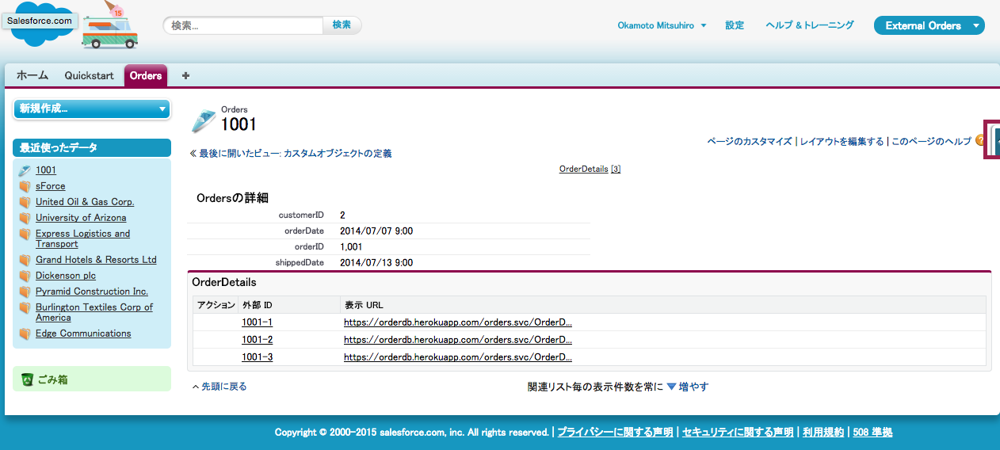
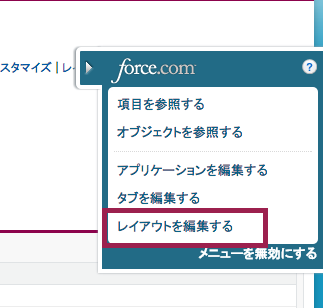
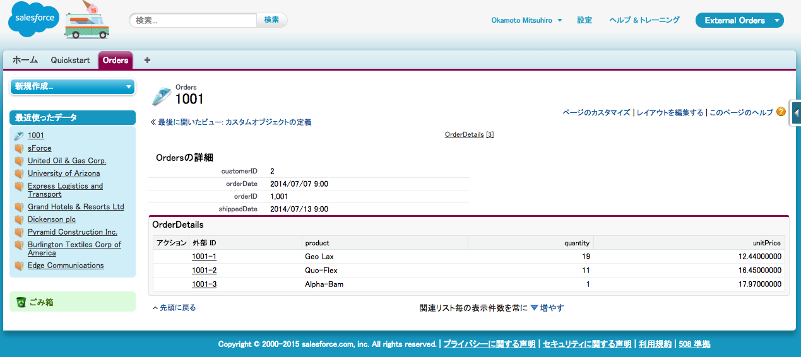
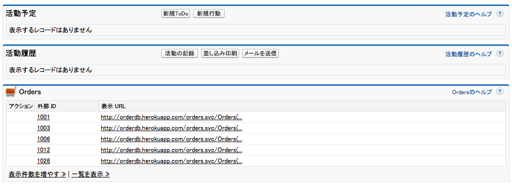
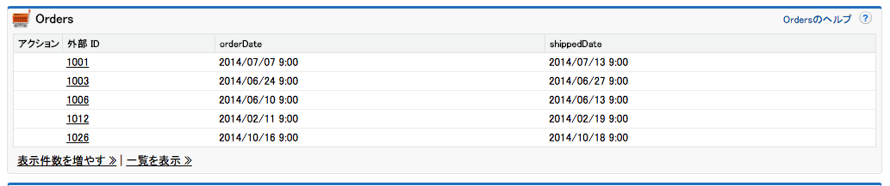

外部の注文データをSalesforce上でみれるようになりました。このモジュールでは、ルックアップ関連を注文と明細、そして取引先に対してSalesforceで設定を行います。

## 何を学ぶことができるか
- 外部参照関係の設定
- 間接参照関係の設定
- 外部オブジェクトの表示をカスタマイズ

## ステップ 1: 外部参照関係の設定

前のモジュールでは、注文情報をSalesforce上で見れるようにしました。ここで注文同期する際に、オーダー毎の明細を持つ OrderDetails テーブルも選択したことを思い出して下さい。ここで*外部参照関係* をOrderDetailsからOrdersに設定することで、Salesforce上の注文ページから明細データを見ることができます。

> 外部参照関係は任意のオブジェクト(標準、カスタム、外部)から外部オブジェクトへ対してモデリングにおける外部キーによる関連と捉えることができます。 Salesforce 内のフィールドを１つ指定し、このケースではOrderDetailsの中のOrderIdを指定して、 対応する外部オブジェクトの外部Id項目を指定します。こおｎケースでは受注テーブルを指します。 Orders.

1. Salesforce Developer Editionへログインします

1. **設定** をクリックします。(右上端)

1. **開発** > **外部オブジェクト**をクリックします (左ナビゲーション)

1. **OrderDetails** 外部オブジェクトをクリックします

	

1. Order IDの横の**編集** リンクをクリックします

	

1. **データ型の変更** ボタンをクリックします

	

1. **外部参照関係** を選択し **次へ** をクリックします。外部参照関係は任意のオブジェクトと外部オブジェクトをリンクすることができます。

1. **Orders** を関連先で選択し、 **次へ** をクリックします。

	

1. **18** を文字数に入力し、 **次へ** をクリックします。

1. **参照可能** チェックボックスで全てのプロファイルでこの参照関係を閲覧可能にし **次へ** をクリックします。

	

	> 実際の運用環境では、どのプロファイルが明細に隠せす可能かどうかを十分に分析した方がよいでしょう。

1. **保存** をクリックし、詳細を確認します - これで '注文明細' 関連リストを注文ページのレイアウトで利用できるようになりました!

1. もしアプリケーショんメニュー (右上) が **External Orders** を表示していない場合は、アプリケーションメニューから選択を行います

1. **注文**タブをクリックします.

1. 最近使った注文のリストから注文の外部Idを選択します

	

1. 注文の明細リストが表示されます

	

1. 明細の外部IDをクリックして詳細確認することもできますが、ここでは明細の詳細は関連リストで見るだけにしておきます。ページの右側にあるForce.comクイックアクセスメニューのグレイの三角形をクリックします。

	

1. **レイアウトを編集する** をクリックします。

	

1. **注文明細** の関連リストまでスクロールし、レンチのアイコンをクリックします。

	

1.  **表示URL** を選択済み項目から除外し、**製品**, **数量** 及び **ユニットプライス** を選択し **OK** をクリックします。

	

1. **保存** をクリックしてトップへ戻り、 注文明細の関連リストの表示を確認します。

	

## ステップ 2: 間接参照関係を設定する

これで注文ページで明細アイテムを閲覧することが可能になりました。次のステップでは、間接参照関係を注文と取引先の間に設定し、どの取引先が注文を行ったのかを閲覧し、どのように取引先と注文が関連し、特定のアカウントの全ての注文情報を見れるかを確認します。

> 間接参照関係は外部キーによる関連を外部オブジェクトとカスタムオブジェクトや標準オブジェクトに設定します。 Salesforceでは外部オブジェクト上の項目を指定し、この場合は注文上のcustomerIdがそれにあたります、 対応する一意の外部ID項目をカスタムもしくは標準オブジェクトから選択します。この場合は取引先上の Customer\_ID__c がそれに当たります。標準的なID項目以外の項目を参照するため、間接参照と呼んでいます。

1. もし注文ページに居ない場合は **外部注文** アプリを選択します(右上), **注文** タブをクリックし、最近使った注文のリストから任意の外部IDを選択します。

1. ページ右側の Force.com クイックアクセスメニューから、グレーの三角のアイコンをクリックします。

1. **項目を参照する**を選択します。

1. Customer IDの横の**編集** リンクをクリックします。

	

1. **データ型の変更** ボタンをクリックします。

1. **間接参照関係** を選択し **次へ** をクリックします。間接参照関係は注文のような外部オブジェクトをと取引先のような標準オブジェクトや、自身で作成したカスタムオブジェクトと関連させます。

1. **取引先** を関連先に選択し **次へ** をクリックします。

	

1. **Customer\_ID__c** を対象項目に選択肢、 **次へ** をクリックします。

	

1. **18** を文字数に入力し、 **次へ** をクリックします。

1. **参照可能** チェックボックスで全てのプロファイルから関連を見れるようにし、 **次へ** をクリックします。

1. **保存** をクリックして反映させます - これで '注文' は取引先のページレイアウトに表示されるようになりました。

1. もしアプリケーションが (右上) 既に **外部注文** が選択されていない場合、アプリケーションメニューより選択します。.

1. **注文** タブをクリックします。

1. 最近使った注文のリストから注文の外部IDを設定します。

1. 注文ページにcustomerID項目がリンクとなって表示されます。

1. customerID リンクがをクリックすると、対応する取引先ページを取得できます。ページ下部へスクロールすると、注文のリストが確認できます。

	

1. 更に、関連リストにより有用な情報がふおじされるようにカスタマイズします。ページ右側のForce.com クイックスタートメニューの三角形のアイコンをクリックします。

1. **レイアウトの編集** をクリックします。

1. **注文** 関連リストまでスクロールし、レンチのアイコンをクリックします。

1. **表示URL** を選択済みの項目から削除し、**注文日** と **配送日**を選択し、並び替えには **注文日** を **降順** で選択し、直近の注文が先に表示されるようにして **OK** をクリックします。

	

1. ページのトップの **保存** をクリックしてスクロールダウンし、オーダー日時が表示されてる事を確認します。

	

これで外部の注文データは取引先とシームレスに統合されました。残りは注文レコードにChatterフィードを有効化し、 Salesforce1モバイル・アプリケーションとの統合を完了させることです。

<a href="configure-data-source-objects.html" class="btn btn-default"><i class="glyphicon glyphicon-chevron-left"></i> 戻る</a>
<a href="enable-chatter-salesforce1.html" class="btn btn-default pull-right">次へ <i class="glyphicon glyphicon-chevron-right"></i></a>

