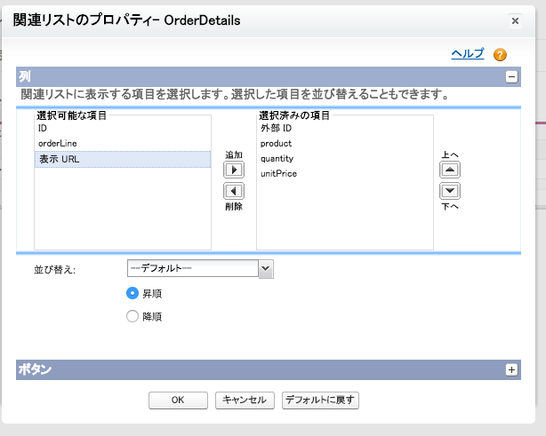

Now you can see external order data in Salesforce; in this module, you will configure lookup relationships to link orders to their line items, and to accounts in Salesforce.

## What you will learn
- Configure an external lookup relationship
- Configure an indirect lookup relationship
- Customize the display of external data

## Step 1: Configure an External Lookup Relationship

In the previous module, you were able to view an order in Salesforce. Recall that when you selected the Orders table for synchronization, you also selected the OrderDetails table, which contains line items for each order. By creating an *external lookup relationship* from OrderDetails to Orders you will be able to see the line items on an order's page in Salesforce.

1. Login to your Salesforce Developer Edition

1. Click **Setup** (upper right corner)

1. Click **Develop** > **External Objects** (left navigation)

1. Click the **OrderDetails** external object.

	

1. Click the **Edit** link next to Order ID.

	

1. Click the **Change Field Type** button.

	

1. Select **External Lookup Relationship** and click **Next**. An external lookup relationship can link any object to an external object.

1. Select **Orders** as the value of Related To and click **Next**.

	

1. Enter **18** as the value for Length and click **Next**.

1. Enable the **Visible** checkbox to make the relationship visible to all profiles, and click **Next**.

	

	> In a real production deployment, you would carefully analyze which profile should have access to order line items.

1. Click **Save** to accept the defaults - we definitely want an 'OrderDetails' related list on the Orders page layout!

1. If the app menu (top right) is not already showing **External Orders**, then click the app menu and select it.

1. Click the **Orders** tab.

1. Click the External ID of an order in the Recent Orders list.

	

1. You should see a list of line items for the order.

	

1. You can click a line item's External ID to view its details, but let's show line item details right here on the related list. Select the Force.com Quick Access Menu by clicking the gray triangle on the right of the page.

		

1. Select **Edit Layout**.

		

1. Scroll down to the **OrderDetails** related list, and click the wrench icon.

		

1. Remove **Display URL** from the Selected Fields, add **product**, **quantity** and **unitPrice**, and click **OK**.

		

1. Click **Save** at the top of the page and you will see order line item details in the related list.

	

## Step 2: Configure an Indirect Lookup Relationship

<a href="create-developer-edition.html" class="btn btn-default"><i class="glyphicon glyphicon-chevron-left"></i> Previous</a>
<a href="create-lookup-relationships.html" class="btn btn-default pull-right">Next <i class="glyphicon glyphicon-chevron-right"></i></a>

