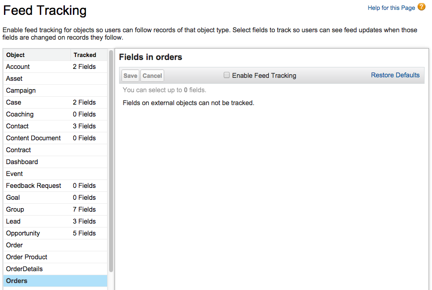
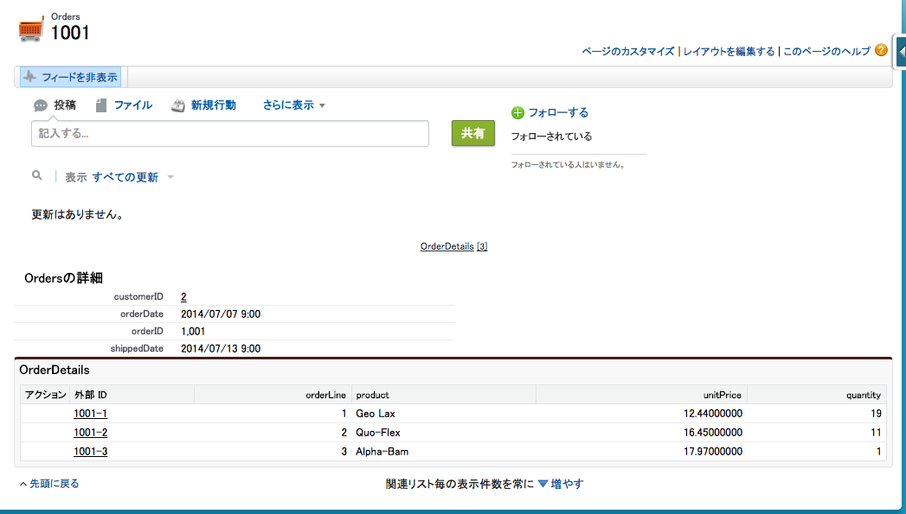
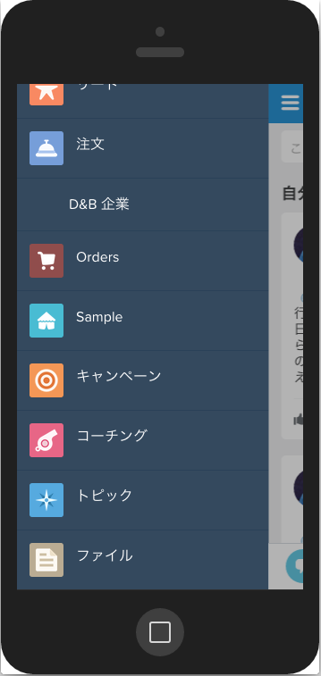
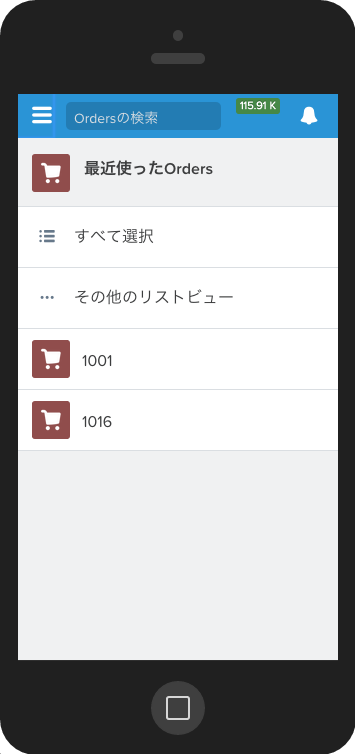
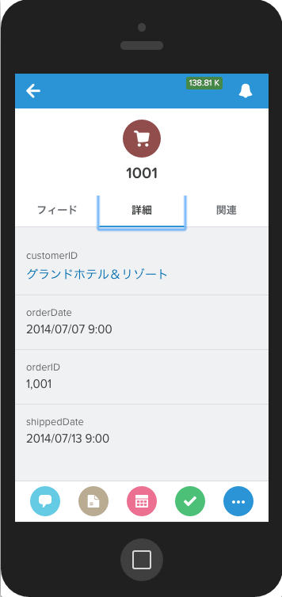
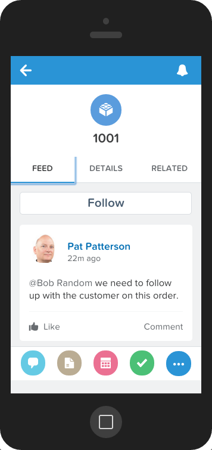
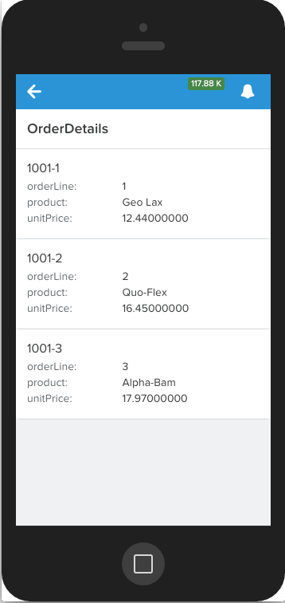
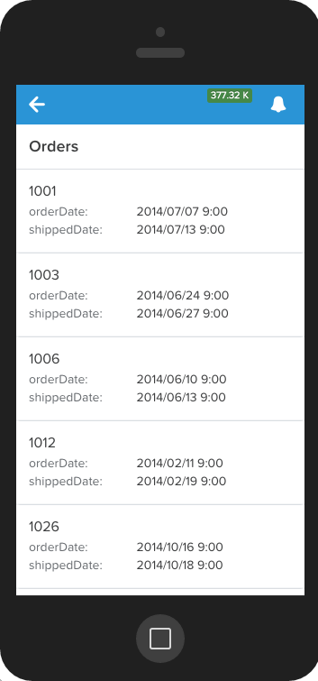

このモジュールでは、ユーザがまわりでコラボレーションできるように注文用のChatterフィードを有効化します。そしてインテグレーションの完成形をSalesforce1モバイルアプリで確認してみます。

## 何を学ぶことができるか
- 外部オブジェクトへのChatterの設定
- 外部データをSalesforce1モバイルアプリで表示する

## ステップ 1: 注文レコード用のchatterを有効化する

現在のリリースでは, *項目追跡* は外部オブジェクトでは有効ではありません。; これは、Salesforceが自動的にレコードのChatterフィードに投稿する機能ですが、それ以外の機能はChatter feedに対応して下さい。

1. Salesforce Developer Editionにログインします

1. **設定** をクリックします(右上隅)

1. **カスタマイズ** > **Chatter** > **フィード追跡** をクリックします(左メニュー)。

1. **Orders** を選択して(複数形のものを選択 - Order は標準オブジェクトです)、 **フィード追跡の有効化** をチェックし **保存** をクリックします。

	

1. もしアプリケーションメニュー (右上) が既に**外部注文** を表示していない場合は、アプリケーションメニューを選択します。

1. **注文** タブをクリックします。

1. 最近見た注文リストの中から外部 IDを選択します。

1. 注文にCHatterフィードが有効化されました。

	

1. Post some text to the Chatter feed. We'll see how it looks in the Salesforce1 mobile app.

## ステップ 2: 外部データをSalesforce1で閲覧する

1. Salesforce1モバイル・アプリを起動します。 Salesforce1はモバイルデバイスで動作させることができますが ([こちらからアプリを入手](http://www.salesforce.com/mobile)), 代わりに [Salesforce1 Simulator Chrome App](https://chrome.google.com/webstore/detail/salesforce1-simulator/cknbjckicenodbiaejbmkjhldffonggp) や、ブラウザウィンドウに以下のURLを入力することでも試せます [https://login.salesforce.com/one/one.app](https://login.salesforce.com/one/one.app) (必要であればDeveloper Editionのユーザ名とパスワードを入力).

1. **ナビゲーションアイコン**をクリックし、 (左上) ナビゲーション・メニューを開きます。取引先と注文が最近リスト内にあるはずです。もしない場合には**表示件数を増やす** をタップして全てのオブジェクトを再起リストから表示します。

	

1. **注文** をクリックし、直近の注文リストを確認します。

	> 設定した外部オブジェクトに加えて標準オブジェクトにもOrdersという同じ名前のオブジェクトがあります。もし直近のレコードが何もない場合には、別の注文オブジェクトを選択して下さい。

	

1. 前のステップで表示した注文リストの一番上のリストをクリックし、詳細を確認します。

	

1. **フィード** タブをクリックし、注文レコードのフィードやポストが見れることを確認します。

	

1. **関連** タブをクリックし、**注文明細** を確認します。

	

1. **戻る矢印** (左上) を２回クリックし、 **ナビゲーションアイコン** (左上) をクリックしてナビゲーション・メニューを開きます。 **取引先** をクリックし、最近参照した取引先のリストを閲覧します。

1. リストの中の取引先をクリックし **関連**タブをクリック、関連リストをスクロールし、**注文** をクリックして、取引先に関連する注文を確認します。

	

これで外部データがSalesforce1の中で、追加のカスタマイズ無しに、Webブラウザからの設定だけで表示させることが出来ました。

<a href="create-lookup-relationships.html" class="btn btn-default"><i class="glyphicon glyphicon-chevron-left"></i> 戻る</a>
<a href="next.html" class="btn btn-default pull-right">次へ <i class="glyphicon glyphicon-chevron-right"></i></a>

