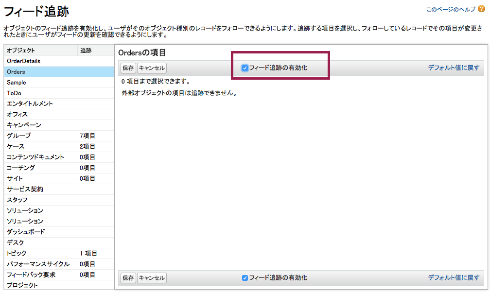
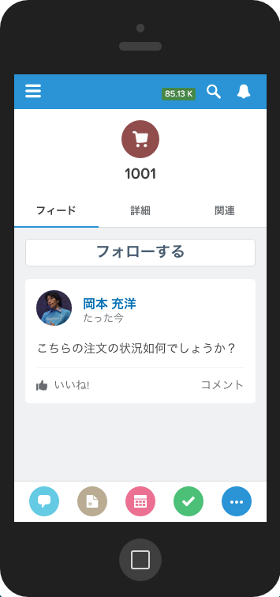

In this module, you will enable the Chatter feed for orders, so users can collaborate around them, and view the finished integration in the Salesforce1 mobile app.

## What you will learn
- Configure Chatter for an external object
- Show external data in the Salesforce1 mobile app

## Step 1: Configure Chatter for Order Records

In the current release, *field tracking* is not available for external objects; that is, we cannot configure Salesforce to automatically post to a record's Chatter feed as its field values change, but we can still enable the Chatter feed.

1. Login to your Salesforce Developer Edition

1. Click **Setup** (upper right corner)

1. Click **Customize** > **Chatter** > **Feed Tracking** (left navigation).

1. Select **Orders** (note the plural - the singular Order is a standard object), click **Enable Feed Tracking** and click **Save**.

1. If the app menu (top right) is not already showing **External Orders**, then click the app menu and select it.

1. Click the **Orders** tab.

1. Click the External ID of an order in the Recent Orders list.

	

1. Now the order should have a Chatter feed.

	

1. Post some text to the Chatter feed. We'll see how it looks in the Salesforce1 mobile app.

## Step 2: View External Data in Salesforce1

1. Start the Salesforce1 mobile app. You can run Salesforce1 on your mobile device ([get the app](http://www.salesforce.com/mobile)), in the [Salesforce1 Simulator Chrome App](https://chrome.google.com/webstore/detail/salesforce1-simulator/cknbjckicenodbiaejbmkjhldffonggp), or by opening a new browser window with the URL `https://instance.salesforce.com/one/one.app`, where `instance` is the Salesforce instance of your Developer Edition - for example, na15.

1. Click the **navigation icon** (top left) to open the navigation menu. You should see Accounts and Orders at the top of the Recent list.

	

1. Click **Orders** to see a list of recent orders.

	

1. The order you were viewing in the previous step should be top of the list. Click it to view its details.

	

1. Click the **Feed** tab to view the order record's feed and your feed post.

	

1. Click the **Related** tab, then 'OrderDetails' to see the order's line items.

	

1. Click the **back arrow** (top left) twice, then click the **navigation icon** (top left) to open the navigation menu. Click **Accounts** to see a list of recent accounts.

1. Click the top account in the list, then click **Related**, scroll down the related lists and then click **Orders** to see the orders for that account.

	

Your external data is available in Salesforce1 just as it is in the desktop browser, with zero additional configuration!

<a href="create-lookup-relationships.html" class="btn btn-default"><i class="glyphicon glyphicon-chevron-left"></i> Previous</a>
<a href="next.html" class="btn btn-default pull-right">Next <i class="glyphicon glyphicon-chevron-right"></i></a>

