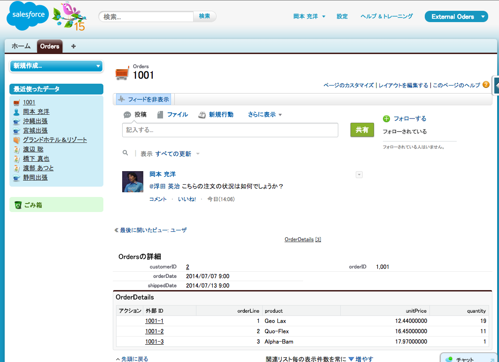

In this tutorial, you use Lightning Connect to integrate order data from an external data source, without writing a line of code, and without duplicating any data into Salesforce. You will configure relationships between external objects and accounts in Salesforce, and see how external objects integrate with Chatter and the Salesforce1 mobile app.

## What You Will Learn

- Configure an external data source
- Synchronize schema to create external objects in Salesforce
- Create relationships to link external objects to each other and to standard objects
- Integrate external objects with Chatter
- See external objects in action in the Salesforce mobile app

## Browser Requirements

The following browsers are supported when working with the Developer Console:

  - Most recent version of Google Chrome
  - Most recent version of Mozilla Firefox
  - Most recent version of Safari
  - Internet Explorer 9 or higher

## Issues

- Please create an issue [here](https://github.com/metadaddy-sfdc/lightning-connect-tutorial/issues) if you run
into any problems or if you have a suggestion to improve this tutorial.
- You can also use the Comments section at the bottom of each module to ask a question or report a problem.

<a href="create-developer-edition.html" class="btn btn-default pull-right">Next <i class="glyphicon glyphicon-chevron-right"></i></a>

