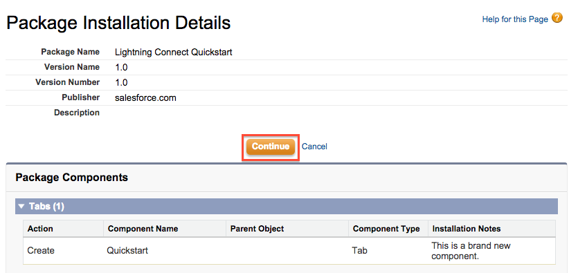
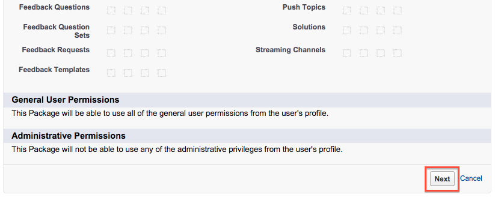
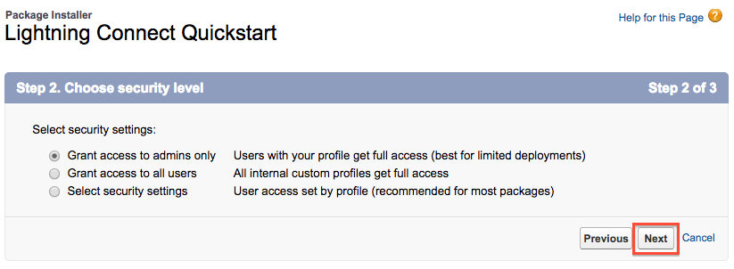
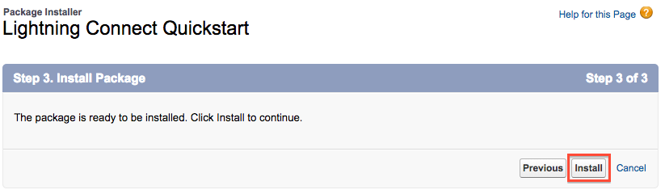
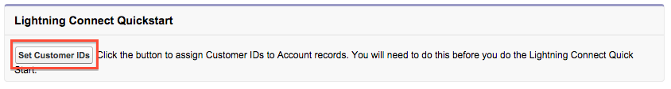

During this tutorial you will integrate sample order data with the existing account data in your Salesforce Developer Edition. In this module you will install a package that configured the necessary schema on the account object, creating a 'Customer ID' field, and assigns a value for Customer ID to each account.

## Steps

1. Open a browser and start the installation by [clicking here](https://login.salesforce.com/packaging/installPackage.apexp?p0=04tE00000001aqG).

1. Click **Continue**.

	

1. Scroll down and click **Next** to accept the package access defaults.

	

1. Click **Next** to access to the package to admins only.

	

1. Click **Install** to complete the package installation

	

1. Click the app menu (top right), then **External Orders**

	

1. Click **Set Customer IDs** to assign customer ID numbers to the sample account records in your Developer Edition.

	

Your Salesforce Developer Edition is now set up for the main section of the tutorial. It's time to integrate some data!

<a href="create-developer-edition.html" class="btn btn-default"><i class="glyphicon glyphicon-chevron-left"></i> Previous</a>
<a href="configure-data-source-objects.html" class="btn btn-default pull-right">Next <i class="glyphicon glyphicon-chevron-right"></i></a>

