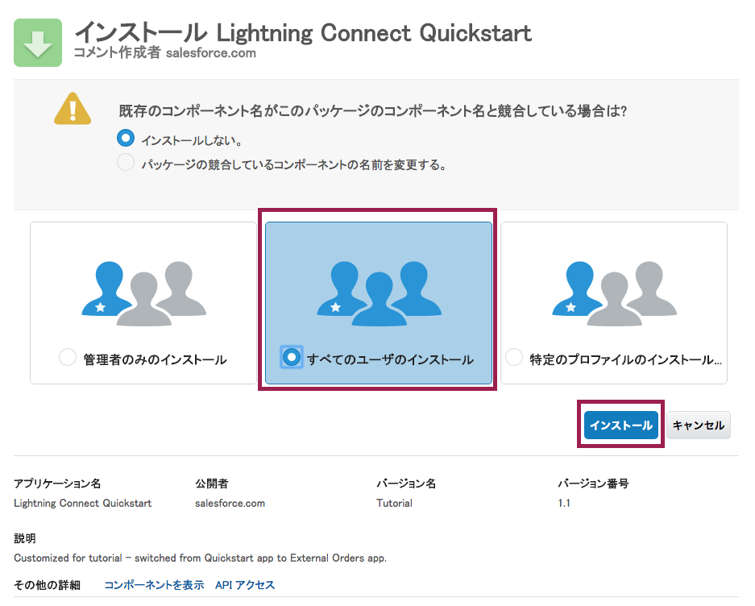
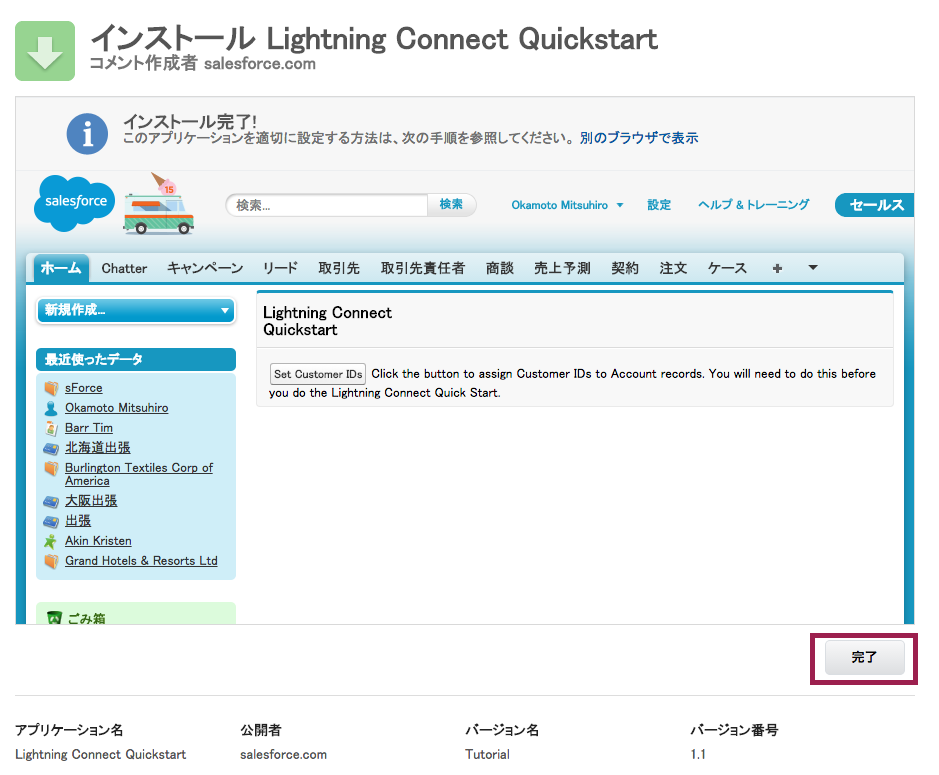

このチュートリアルでは、サンプルの注文データを既存のSalesforce Developer Edition内の取引先のデータと統合します。このモジュールでは、取引先に'Customer ID'項目を追加してスキーマを更新し、それぞれの取引先にCustomer IDを付与します。

## ステップ

1. ブラウザを開き[こちらをクリック](https://login.salesforce.com/packaging/installPackage.apexp?p0=04tE00000001aqG)してパッケージをインストールします。

1. **次へ**をクリックします。

	

1. 下へスクロールし、 **次へ** をクリックしてデフォルトのパッケージアクセス権限を許可します。

	

1. **次へ** をクリックして、パッケージへのアクセスを管理者のみにします。

	

1. **インストール** をクリックし、パッケージのインストールを完了します。

	

1. 右上のアプリケーションメニューより**外部のオーダー** を開きます

	

1. **Customer IDの設定** によって、Customer ID番号がサンプルのDeveloper Edition内のサンプルの取引先レコードに追加されます。

	

これでこのDeveloper Editionはチュートリアルのための準備が整いました。次はいよいよデータを統合してみましょう!

<a href="create-developer-edition.html" class="btn btn-default"><i class="glyphicon glyphicon-chevron-left"></i> 戻る</a>
<a href="configure-data-source-objects.html" class="btn btn-default pull-right">次へ <i class="glyphicon glyphicon-chevron-right"></i></a>

